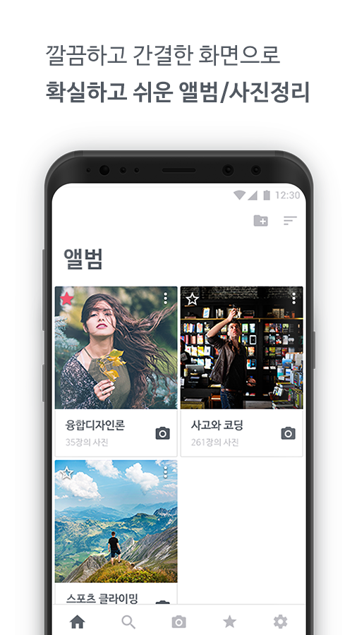
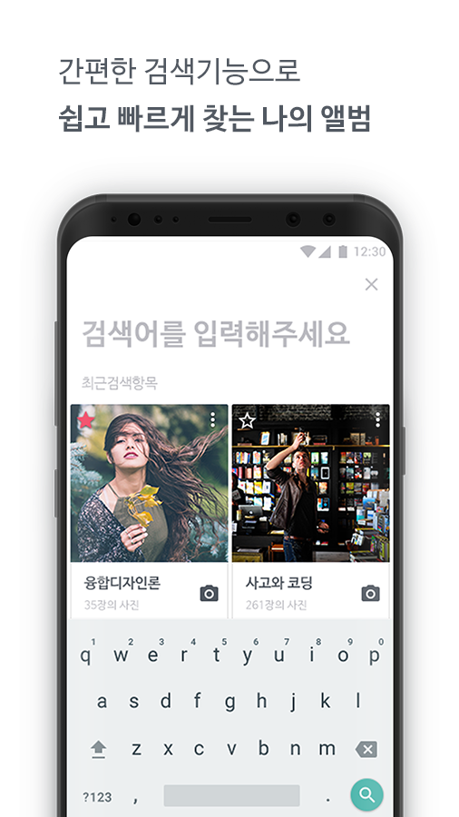
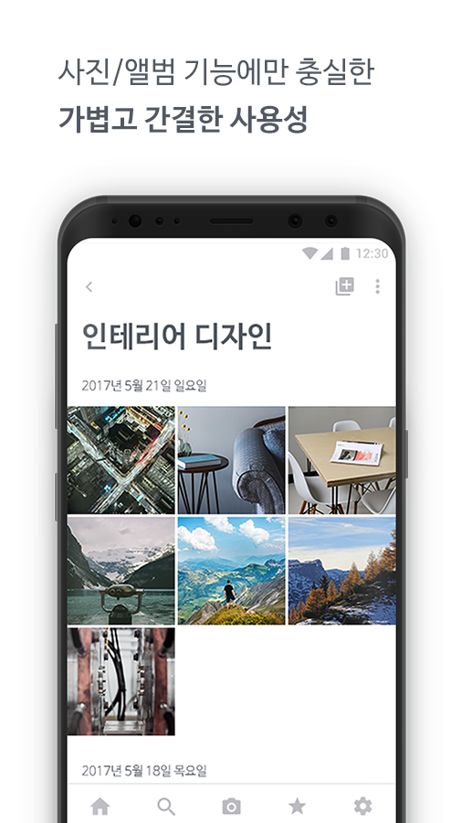
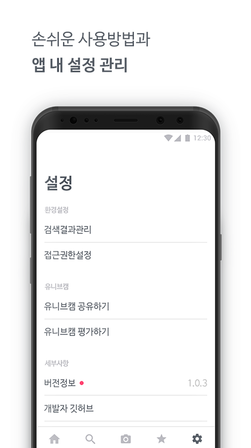
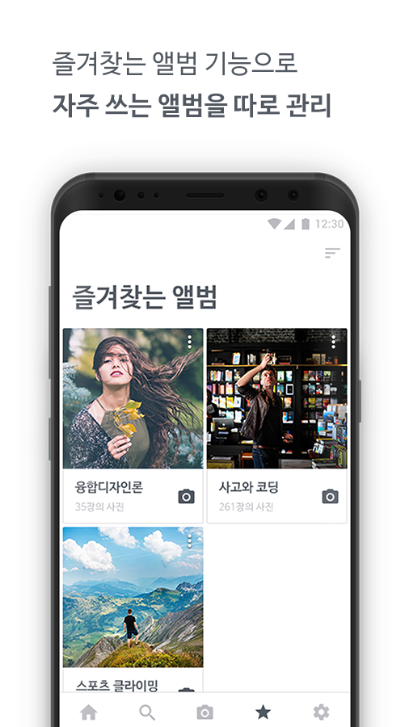
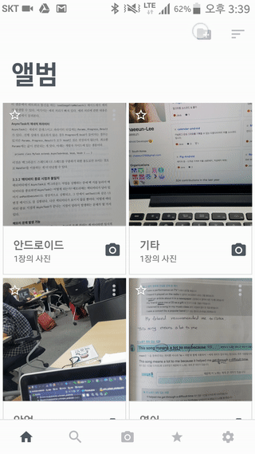

# UnivCam-android

- 대학생을 위한 카메라,갤러리 어플
- 유니브캠은 인천대학교 앱 개발 동아리 앱센터에서 개발했습니다. 
- 개발 기간 : 2017/07 ~ 
- 사용 언어 : Kotlin, Java
- 기획자(김승현), 디자이너(서혁), 안드로이드 개발자(이채은)

|     |      |     |     |    | 
| --- | --- | --- | --- | --- | 
|   |  |  |  |  | 

## 실제 앱 동작 화면
| 메인화면, 사진찍기, 상세화면 | 
| --- | 
|   | 

| 즐겨찾는 앨범, 앨범 검색 | 
| --- | 
|   | 

| 앨범 추가,  | 
| --- | 
|   | 
